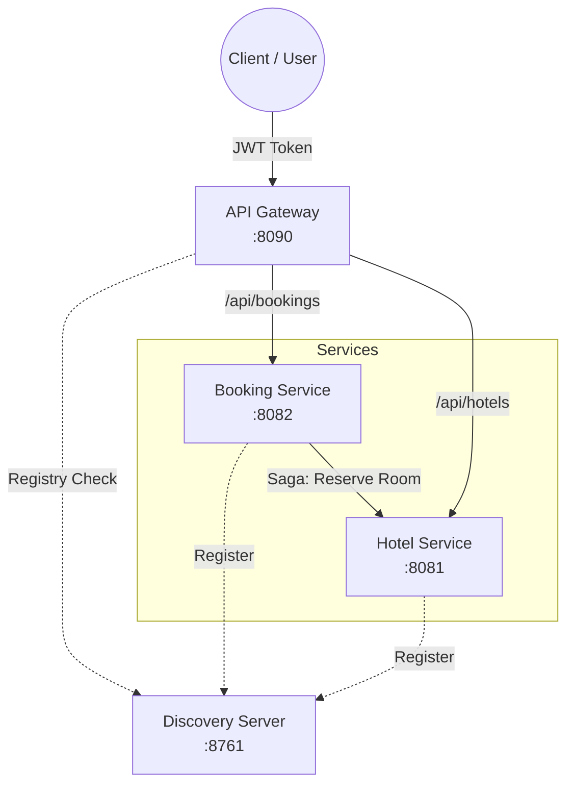
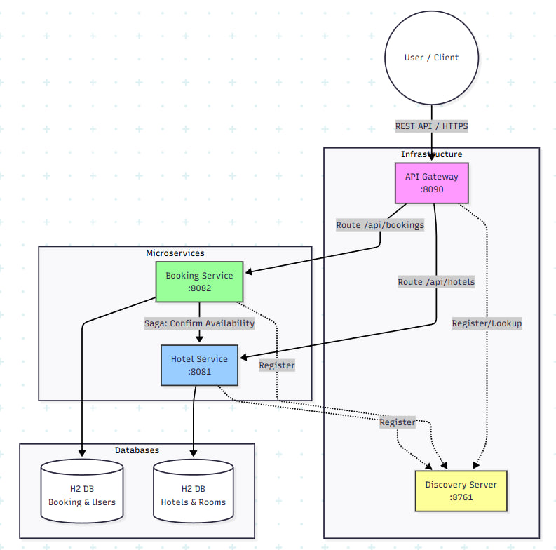

# 🏨 Hotel Booking System (Microservices)


Высоконагруженная система бронирования отелей, построенная на микросервисной архитектуре.
Проект реализует паттерн **Saga** для обеспечения согласованности данных между сервисами, алгоритм автоматического подбора номеров и защиту от конкурентной записи (Race Conditions).

---

## 📑 Содержание
1. [Архитектура](#-архитектура)
2. [Ключевые особенности](#-ключевые-особенности)
3. [Стек технологий](#-стек-технологий)
4. [Запуск проекта](#-запуск-проекта)
5. [API Эндпоинты](#-api-эндпоинты)
6. [Тестирование](#-тестирование)
7. [Структура проекта](#-структура-проекта)

---

# 🏗 Архитектура

Система состоит из 4-х взаимосвязанных микросервисов, оркестрируемых через Docker Compose.


    

## 🌟 Ключевые особенности

1. **Распределенная транзакция (Saga Pattern)**
   * Оркестрация процесса бронирования. При ошибке на этапе подтверждения номера в `HotelService` происходит автоматическая компенсация (отмена) брони в `BookingService`.

2. **Resilience & Fault Tolerance**
   * Использование **Timeouts** и **Retries** при межсервисном взаимодействии. Если `HotelService` временно недоступен, система повторит запрос перед тем, как вернуть ошибку.

3. **Умный алгоритм (Auto-Select)**
   * Реализована логика автоматического подбора "лучшей" комнаты на основе статистики (`timesBooked`), чтобы обеспечить равномерный износ номерного фонда.

4. **Безопасность (Security)**
   * **JWT Authentication**: Полная защита API.
   * **Role-Based Access Control**: Разделение прав на `USER` и `ADMIN`.
   * Валидация токенов на уровне Gateway и Resource Servers.

5. **Защита данных**
   * Предотвращение овербукинга (Double Booking) на уровне БД.
   * Корректная обработка конкурентных запросов на одни и те же даты.

---

## 🛠 Стек технологий

* **Core**: Java 17, Spring Boot 3.3.0
* **Infrastructure**: Spring Cloud Gateway, Netflix Eureka
* **Database**: H2 (In-Memory) с сохранением состояния при перезапусках
* **Containerization**: Docker, Docker Compose
* **Testing**: JUnit 5, MockMvc, Integration Tests (Testcontainers-style)
* **Communication**: REST (WebClient)

---

## 🚀 Запуск проекта

### Требования
* Docker & Docker Compose
* Maven (для сборки)

### Пошаговая инструкция

1. **Клонирование репозитория**
   ```bash
   git clone [https://github.com/ВАШ_НИК/hotel-booking-system.git](https://github.com/ВАШ_НИК/hotel-booking-system.git)
   cd hotel-booking-system

### Сборка JAR-файлов
Очистка и компиляция всех микросервисов:
```bash
mvn clean package -DskipTests

###Запуск контейнеров
Поднятие всей инфраструктуры одной командой:
```bash
docker-compose up --build

### Проверка готовности

* Eureka Dashboard: http://localhost:8761 (Убедитесь, что все 3 сервиса зарегистрированы).

* API Gateway: Доступен по адресу http://localhost:8090.

###🔌 API Эндпоинты
## 🔐 Аутентификация
| Метод | URL               | Описание          | Тело запроса (JSON)                              |
|------:|-------------------|-------------------|--------------------------------------------------|
| POST  | /api/auth/token   | Получение токена  | `{"username":"...","password":"..."}`            |
| POST  | /api/auth/register| Регистрация       | `{"username":"...","password":"..."}`            |

## Предустановленные пользователи:

* Admin: admin / password

## 🏨 Отели (Hotel Service)
| Метод | URL                   | Описание                | Роль                                             |
|------:|-----------------------|-------------------------|--------------------------------------------------|
| GET   | /api/hotels           | Получить список отелей  | USER                                             |
| GET   | /api/hotels/{id}/rooms| Получить комнаты отеля  | USER                                             |
| POST  | /api/hotels           | Добавить новый отель    | ADMIN                                            |

## 📅 Бронирование (Booking Service)

| Метод  | URL                   | Описание                        | Роль                                             |
|------: |-----------------------|---------------------------------|--------------------------------------------------|
| POST   | /api/bookings         | Создать бронь(см. пример ниже)  | USER                                             |
| DELETE | /api/bookings/{id}    | Отменить свою бронь             | USER                                             |
| DELETE | /user?id={id}	     | Удалить пользователя            | ADMIN                                            |

## Пример создания брони (Auto-Select):
```json
POST /api/bookings
Header: Authorization: Bearer <TOKEN>
{
    "userId": 2,
    "hotelId": 1,
    "autoSelect": true,
    "startDate": "2025-06-01",
    "endDate": "2025-06-10"
}

### 🧪 Тестирование
## Проект покрыт тестами на двух уровнях: Unit и Integration E2E.
# 1. Запуск Unit-тестов (MockMvc)

* Проверка контроллеров, валидации и обработки ошибок без поднятия Docker.
````bash
mvn test

# 2. Запуск E2E сценария (FullSystemTest)

* Интеграционный тест, проверяющий полный цикл работы системы на реальных Docker-контейнерах.

* Расположение: booking-service/src/test/java/.../FullSystemTest.java

* Запуск: Через IDE или Maven (требуется запущенный docker-compose).

# 3. Bash-скрипт (Демонстрация)
* В корне проекта находится скрипт test_scenario.sh, который автоматически:
* Логинится под Админом и Клиентом.
* Создает бронирование.
* Пытается создать дубликат (проверка защиты).
* Отменяет бронирование.

* Запуск:

```bash
./test_scenario.sh

### 📂 Структура проекта

* discovery-server — Eureka Service Registry.

* api-gateway — Единая точка входа (Routing, Security).

* hotel-service — Управление номерным фондом (CRUD).

* booking-service — Бизнес-логика бронирования, Сага, Пользователи.


